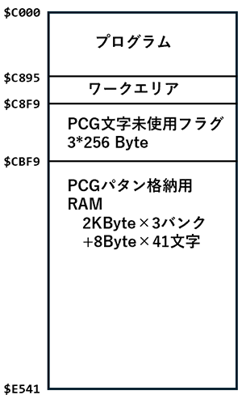

# 新PCG用グラフィックルーチン群とデモプログラム
ちくらっぺさん([@chiplappe](https://twitter.com/chiqlappe))の[新PCG](https://github.com/chiqlappe/new_pcg)のデモ用のライブラリです。40桁×25行で
実行するので、320×200ドットのグラフィックが扱えます。

機能としては、

- 点を打つ
- ラインを引く
- 円を描く
- BOXを描く

が行えます。

- 描画実行時に、引数を追加 0:PSET(描画), 1:PRESET(消去), 2:XOR(XOR)の３つのモードを実現
- CIRCLEで同じ場所に２回プロットしないように、処理を追加
- PCGのパタンの記憶用メモリを、Block3は41キャラに限定し、ワークエリアの削減を実施

ソースをいじれば、80桁×40行でも実行可能ですが、その場合は各ブロックの
文字数が640文字となり、256種ではすぐに文字が足りなくなりそうなので、
1ブロックあたり320文字の40桁モードを利用してます。

# 動作原理
最初にPCGのパタンを255で全クリア。ブロック３以外の画面を文字コード0で埋めておく。<br>
ブロック３は40文字しかないので、最初から文字コード1～40の文字で埋めておく。<br>
各PCGのブロックの文字コード0は空白を表現する文字としてリザーブ。


ドットをプロットする際は、次の手順で実行。

1. 当該位置に文字が存在すれば、その文字に対して、ドットを追加
2. 文字が存在しない場合は、当該ブロックの未使用文字を検索し、当該位置に文字を置き、ドットを追加。未使用文字を使用中と記録。
3. 未使用文字がない場合は、これ以上プロットできないものとして、プロットリクエストを無視。


# 利用時の準備
C000Hよりマシン語で書かれているので、BASICプログラムでは
```
CLEAR 300, &HBFFF
```
を記述してください。詳細な記述方法は、[デモプログラム](#デモプログラム)を参照ください。

新PCGをグラフィック画面的に使用するサブルーチン群は、```pcg_demo5.cmt```にマシン語ファイルとして格納されています。

# メモリマップ
メモリマップは以下の通り。PCG内の登録パタンを本体メモリ側に格納する必要があるため、それだけで8kByteのメモリが必要に
なってましたが、バンク３のパタンは、41キャラ分しか使用しないので、その分を節約しました。



# 基本的な使い方
DEF USR を使って、ユーザ関数として呼び出します。引数は、整数型です。

```
DEF USR1=&hC000 : A%=USR1(0)     : 'PCGの初期化
DEF USR2=&hC003 : A%=USR2(X1%)   : 'X1座標のセット
DEF USR3=&hC006 : A%=USR3(Y1%)   : 'Y1座標のセット
DEF USR4=&hC009 : A%=USR4(X2%)   : 'X2座標のセット
DEF USR5=&hC00C : A%=USR5(Y2%)   : 'Y2座標のセット
DEF USR6=&HC00F : A%=USR6(0|1|2) : 'PSET/PRESET/PXOR(X1, Y1) 実施。 引数0:PSET,1:PRESET,2:XOR
DEF USR7=&HC012 : A%=USR7(0|1|2|4|5|6|8|9|12) : '(X1,Y1)-(X2,Y2)にラインを描画。引数で，0:line, 1:line preset, 2:line xor, 4:box, 5:box preset, 6:box xor, 8:boxfill, 9:boxfill preset, 12:boxfill xor 実行
DEF USR8=&HC015 : A%=USR8(0|1|2) : '(X1,Y1)を中心に半径X2 の円を描く。引数0:PSET,1:PRESET,2:XOR
DEF USR9=&HC018 : A%=USR9(0)     : 'バッファフラッシュ
```

## 初期化(画面クリア)
PCGや画面の初期化は、&HC000 のルーチンで行います。
```
DEF USR1=&hC000 : A%=USR1(0): 'PCGの初期化
LOCATE 0,0,0                : 'カーソル非表示
```
40桁×25行、白黒モードで初期化されます。
また、カーソルは ```locate 0,0,0``` で非表示にしておくとよいです。

### pset
グラフィックで(X%, Y%)座標に１点プロットを打つ手順は以下の通り

1. ```DEF USR2=&HC003``` の ```A%=USR2(X%)``` でX座標を指定、
2. ```DEF USR3=&HC006``` の ```A%=USR3(Y%)``` でY座標を指定
3. ```DEF USR6=&HC00F``` の ```A%=USR6(0|1|2)```でPSET実行.引数0:PSET,1:PRESET,2:XOR
4. 1～3を必要なだけ繰り返す
5. ```DEF USR9=&HC018``` の ```A%=USR9(0)```でバッファ上のPCGの設定を反映させる

プロットは、16点プロットされるごとに、PCGに対してVSYNC待ちを行い、反映されます。
毎回PCGに対して反映させたい場合は、明示的に```A%=USR9(0)```を実行してください。

### line, box, boxfill
グラフィックで(X1%, Y1%)-(X2%,Y2%)に直線を描画する

1. ```DEF USR2=&HC003``` の ```A%=USR2(X1%)``` でX1座標を指定、
2. ```DEF USR3=&HC006``` の ```A%=USR3(Y1%)``` でY1座標を指定
3. ```DEF USR4=&HC009``` の ```A%=USR4(X2%)``` でX2座標を指定、
4. ```DEF USR5=&HC00C``` の ```A%=USR5(Y2%)``` でY2座標を指定
5. ```DEF USR7=&HC012``` の ```A%=USR7(0|1|2|4|5|6|8|9|12)``` 引数により　0:line, 1:line preset, 2:line xor, 4:box, 5:box preset, 6:box xor, 8:boxfill, 9:boxfill preset, 12:boxfill xor 実行
6. 1～5を必要なだけ繰り返す
7. ```DEF USR9=&HC018``` の ```A%=USR9(0)```でバッファ上のPCGの設定を反映させる

line では、内部的に pset 機能が呼び出され、16点プロットされるごとに、
PCGに対してVSYNC待ちを行い、反映されます。毎回PCGに対して反映させたい場合は、
明示的に```A%=USR9(0)```を実行してください。

### circle
グラフィックで、(X%, Y%)座標を中心、半径R%の円を描く

1. ```DEF USR2=&HC003``` の ```A%=USR2(X%)``` でX座標を指定、
2. ```DEF USR3=&HC006``` の ```A%=USR3(Y%)``` でY座標を指定
3. ```DEF USR4=&HC009``` の ```A%=USR4(R%)``` で半径を指定、
4. ```DEF USR8=&HC015``` の ```A%=USR8(0|1|2)``` でcircle実行.引数0:PSET,1:PRESET,2:XOR
5. 1～4を必要なだけ繰り返す
6. ```DEF USR9=&HC018``` の ```A%=USR9(0)```でバッファ上のPCGの設定を反映させる

circle では、内部的に pset 機能が呼び出され、16点プロットされるごとに、
PCGに対してVSYNC待ちを行い、反映されます。基本的に、circleでは円を８分割して描画して
いるので、毎回バッファのフラッシュを行う必要はなく、
最後に```A%=USR9(0)```を実行するだけで十分だと考えられます。


#### 円描画アルゴリズム
円描画アルゴリズムは、[伝説のお茶の間](https://dencha.ojaru.jp/index.html)で解説されている、
[ミッチェナー(Miechener) の円描画](https://dencha.ojaru.jp/programs_07/pg_graphic_09a1.html)の
コードをベースに、同じ点を２度プロットしないような条件を加えたコードになっています。

コード修正の目的は、XOR 描画モードで描画しても、途中で途切れることや、２回 XOR 描画モードで描画した際の消し忘れ
が起きないようにするためのものです。

```
void MiechenerCircle (HDC hdc, LONG radius, POINT center, COLORREF col){
    LONG cx, cy, d;

    d = 3 - 2 * radius;
    cy = radius;

    // 開始点の描画
    SetPixel (hdc, center.x, radius + center.y, col);   // point (0, R);
    SetPixel (hdc, center.x, -radius + center.y, col);  // point (0, -R);
    SetPixel (hdc, radius + center.x, center.y, col);   // point (R, 0);
    SetPixel (hdc, -radius + center.x, center.y, col);  // point (-R, 0);

    for (cx = 0; cx <= cy; cx++) {
        if (d < 0)  d += 6  + 4 * cx;
        else        d += 10 + 4 * cx - 4 * cy--;

        // 描画 ※ブロック内の２つのif文は、２度同じ場所にプロットしない為のコード
        if (cx <= cy) {
            SetPixel (hdc,  cy + center.x,  cx + center.y, col);        // 0-45     度の間
            SetPixel (hdc, -cx + center.x,  cy + center.y, col);        // 90-135   度の間
            SetPixel (hdc, -cy + center.x, -cx + center.y, col);        // 180-225  度の間
            SetPixel (hdc,  cx + center.x, -cy + center.y, col);        // 270-315  度の間
        
            if (cx != cy) {
                SetPixel (hdc,  cx + center.x,  cy + center.y, col);    // 45-90    度の間
                SetPixel (hdc, -cy + center.x,  cx + center.y, col);    // 135-180  度の間
                SetPixel (hdc, -cx + center.x, -cy + center.y, col);    // 225-270  度の間
                SetPixel (hdc,  cy + center.x, -cx + center.y, col);    // 315-360  度の間
            }
        }
    }
}
```

# デモプログラム
本ライブラリとN-BASICで書かれたデモプログラムのCMTファイルを4個用意しました。

## 3D demo プログラム
[00_PCG_3D.CMT](./00_PCG_3D.CMT) で、マシン語とBASICからなります。実行には、20分強かかります。

```
mon
*L
*[Ctrl+B]
cload"DEMO"
run
```

```
10000 CLEAR 300,&HBFFF
10010 TIME$="00:00:00":LOCATE 0,0,0
10020 DEF USR1=&HC000:A=USR1(0)
10030 DEF USR2=&HC003:DEF USR3=&HC006:DEF USR4=&HC00F:DEF USR5=&HC018
10040 DIM DT%(255),DB%(255):DR=3.14/90
10050 FOR I=0 TO 255:DT%(I)=192:DB%(I)=-1:NEXT
10060 FOR Y=-45 TO 45:FOR X=-90 TO 90 STEP 2
10070 R=DR*SQR(X*X+Y*Y*4):Z=50*COS(R)-15*COS(3*R)
10080 SX%=INT(128+X-Y):SY%=INT(80-Y-Z):PS=0
10090 IF SX%<0 OR 255<SX% THEN 10130
10100 IF DT%(SX%)>SY% THEN DT%(SX%)=SY%:PS=1
10110 IF DB%(SX%)<SY% THEN DB%(SX%)=SY%:PS=1
10120 IF PS THEN A%=USR2(INT(SX%+32)):A%=USR3(SY%):A%=USR4(0)
10130 A%=USR5(0):NEXT X,Y
10140 COLOR 8:LOCATE 16,24:PRINT TIME$;
10150 A$=INKEY$:IF A$="" GOTO 10150
10160 LOCATE 0,0,1:OUT 8,0:PRINT CHR$(12)
```
## circle デモプログラム
[00_PCG_CIRCLE.CMT](./00_PCG_CIRCLE.CMT) で、マシン語とBASICからなります。ほぼすべての処理がマシン語で実行されるので、実行時間は約10秒
```
mon
*L
*[Ctrl+B]
cload"DEMO"
run
```


```
1000 CLEAR 300,&HBFFF
1010 TIME$="00:00:00":LOCATE 0,0,0
1020 DEF USR1=&HC000:A=USR1(0)
1030 DEF USR2=&HC003:DEF USR3=&HC006:DEF USR4=&HC009:DEF USR5=&HC015
1040 DEF USR6=&HC015
1050 FOR I%=0 TO 15
1060 X0%=RND(1)*240+70:Y0%=RND(1)*160+20:R%=RND(1)*60+5
1070 A%=USR2(X0%):A%=USR3(Y0%):A%=USR4(R%):A%=USR5(0)
1080 NEXT
1090 COLOR 8:LOCATE 16,24:PRINT TIME$;
1100 A$=INKEY$:IF A$="" GOTO 1100
1110 LOCATE 0,0,1:OUT 8,0:PRINT CHR$(12)
```

## line デモプログラム
[00_PCG_LINE.CMT](./00_PCG_LINE.CMT) で、マシン語とBASICからなります。SINカーブの計算がBASICで行われているため、実行時間は約40秒
```
mon
*L
*[Ctrl+B]
cload"DEMO"
run
```


```
1000 CLEAR 300,&HBFFF
1010 TIME$="00:00:00":LOCATE 0,0,0
1020 DEF USR1=&HC000:A=USR1(0)
1030 DEF USR2=&HC003:DEF USR3=&HC006:DEF USR4=&HC009:DEF USR5=&HC00C
1040 DEF USR6=&HC012:DEF USR7=&HC018
1050 '
1060 X1%=0:Y1%=50
1070 FOR T%=1 TO 319 STEP 2
1080 X0%=X1%:Y0%=Y1%:X1%=T%:Y1%=20*SIN(T%/32*3.1415)+50
1090 A%=USR2(X0%):A%=USR3(Y0%):A%=USR4(X1%):A%=USR5(Y1%):A%=USR6(0)
1100 A%=USR7(0):NEXT
1110 '
1120 X1%=0:Y1%=100
1130 FOR T%=1 TO 319 STEP 2
1140 X0%=X1%:Y0%=Y1%:X1%=T%:Y1%=20*SIN(T%/16*3.1415)+100
1150 A%=USR2(X0%):A%=USR3(Y0%):A%=USR4(X1%):A%=USR5(Y1%):A%=USR6(0)
1160 A%=USR7(0):NEXT
1170 '
1180 X1%=0:Y1%=150
1190 FOR T%=1 TO 319
1200 X0%=X1%:Y0%=Y1%:X1%=T%:Y1%=20*SIN(T%/8*3.1415)+150
1210 A%=USR2(X0%):A%=USR3(Y0%):A%=USR4(X1%):A%=USR5(Y1%):A%=USR6(0)
1220 A%=USR7(0):NEXT
1230 '
1240 COLOR 8:LOCATE 16,24:PRINT TIME$;
1250 A$=INKEY$:IF A$="" GOTO 1250
1260 LOCATE 0,0,1:OUT 8,0:WIDTH 80,25:PRINT CHR$(12)
```
## boxfill デモプログラム
[00_PCG_BOX.CMT](./00_PCG_BOX.CMT) で、マシン語とBASICからなります。XORによる不思議なふるまいを楽しんでください。実行時間は約50秒
```
mon
*L
*[Ctrl+B]
cload"DEMO"
run
```

```
10000 '
10010 ' Demonstration of XOR circle, box, and box fill
10020 '
10030 CLEAR 300,&HBFFF
10040 TIME$="00:00:00"
10050 DEF USR1=&HC000:A=USR1(0)
10060 DEF USR2=&HC003:DEF USR3=&HC006:DEF USR4=&HC009:DEF USR5=&HC00C
10070 DEF USR6=&HC015:DEF USR7=&HC00F:DEF USR8=&HC012:DEF USR9=&HC018
10080 '
10090 FOR I%=1 TO 120 STEP 5
10100 A%=USR2(160):A%=USR3(100):A%=USR4(I%):A%=USR6(2)
10110 NEXT
10120 '
10130 A%=USR2(81):A%=USR3(21):A%=USR4(239):A%=USR5(179):A%=USR8(10)
10140 '
10150 FOR I%=1 TO 120 STEP 5
10160 A%=USR2(160):A%=USR3(100):A%=USR4(I%):A%=USR6(2)
10170 NEXT
10180 '
10190 FOR I%=4 TO 78 STEP 4
10200 A%=USR2(81+I%):A%=USR3(21+I%):A%=USR4(239-I%):A%=USR5(179-I%):A%=USR8(5)
10210 NEXT
10220 '
10230 FOR I%=1 TO 120 STEP 5
10240 A%=USR2(160):A%=USR3(100):A%=USR4(I%):A%=USR6(2)
10250 NEXT
10260 '
10270 A%=USR2(81):A%=USR3(21):A%=USR4(239):A%=USR5(179):A%=USR8(10)
10280 '
10290 FOR I%=4 TO 78 STEP 4
10300 A%=USR2(81+I%):A%=USR3(21+I%):A%=USR4(239-I%):A%=USR5(179-I%):A%=USR8(6)
10310 NEXT
10320 '
10330 COLOR 8:LOCATE 16,24:PRINT TIME$;
10340 A$=INKEY$:IF A$="" GOTO 10340
10350 LOCATE 0,0,1:OUT 8,0:PRINT CHR$(12):WIDTH 80,25
```
